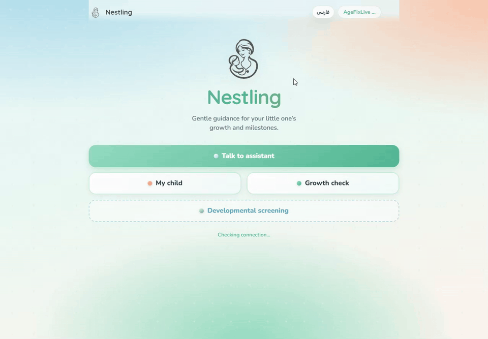

# Nestling

Nestling is a **parent-facing pediatric assistant**: growth charting (WHO term + INTERGROWTH preterm), age-aware feeding/sleep/iron/speech/skin/milestone guidance, and optional ASQ / M-CHAT screening helpers. The UI and API speak **English and Persian (FA)**. Growth numbers always come from deterministic clinical tools—not from the LLM.

## Demo



[Download full demo (MP4)](docs/assets/demo.mp4)

## Features

- **Growth tools** — percentiles / overlays for weight, length/height, and head circumference; WHO (term) and INTERGROWTH (preterm PMA) routing
- **Care guidance (RAG)** — curated notes on feeding by age, sleep, iron/nutrition, development milestones, speech concerns, skin/vision care
- **Bilingual chat** — FA ↔ EN detection and replies; UI language via `ui_lang`
- **Child memory** — profiles, growth history, screenings, chat sessions (SQLite)
- **Topic-aware turns** — intent routing + thread topic so follow-ups stay on the current care topic when the parent switches or continues
- **Chronological age for care** — feeding/sleep/milestones use chronological months (not mistaken PMA−GA “corrected” ages); chart standards stay separate
- **Streaming chat** — `POST /api/chat/stream` (SSE tokens + final result event)
- **Vision assist** — `POST /api/chat/vision` (photo + caption; falls back to RAG if vision LLM unavailable)
- **Screening helpers** — ASQ question lists / scoring, M-CHAT-R questions / scoring
- **Optional local LLM** — openbmb/MiniCPM5-1B via a vLLM OpenAI-compatible sidecar; without it, chat still works with extractive RAG

## Architecture

```
┌─────────────────┐     ┌──────────────────────────────────────────┐
│  web/ (SPA)     │────▶│  FastAPI app (app/)  :8000                │
└─────────────────┘     │  /api/*  + static UI                      │
                        └────────────┬─────────────────────────────┘
                                     │
              ┌──────────────────────┼──────────────────────┐
              ▼                      ▼                      ▼
     Clinical tools           RAG stores              Chat memory
     (WHO / IG eqs,           (BM25 + optional        (sessions,
      overlays, ASQ/M-CHAT)    dense bge-m3)           child DB)
                                     │
                                     ▼
                          Optional MiniCPM sidecar
                          (docker profile `llm`)
                          host :8001 → container :8000
```

| Piece | Role |
|---|---|
| `app/` | FastAPI entry (`app.main`), routes, auth |
| `web/` | Parent SPA (chat, charts, child dossier) |
| `assistant/agent/` | Intent routing, slots, orchestrator |
| `assistant/tools/` | Deterministic growth + screening |
| `assistant/rag/` | Knowledge retrieval + LLM or extractive answer |
| `assistant/llm/qwen_client.py` | OpenAI-compatible client for text/vision |
| `assistant/settings.py` | Typed `NESTLING_*` / LLM settings |
| `config/` | WHO LMS, ASQ/M-CHAT, clinical bounds, intent rules |
| `data/en/` | Curated markdown knowledge sources |
| `data/knowledge/` | Chunked RAG index (`chunks.json`) |

## Requirements

- **Docker** + Docker Compose (preferred path)
- **Python 3.12+** if running locally without Docker
- **GPU (optional)** — NVIDIA GPU + [NVIDIA Container Toolkit](https://docs.nvidia.com/datacenter/cloud-native/container-toolkit/latest/install-guide.html) for the `llm` profile; without a usable GPU, `deploy.sh` degrades to app-only / extractive mode

## Quick start

### App only (no LLM sidecar)

From the repo root (PowerShell or bash):

```bash
docker compose up --build -d nestling
```

- UI + API: [http://localhost:8000](http://localhost:8000)
- Health: [http://localhost:8000/api/health](http://localhost:8000/api/health)

Optional smoke scenarios inside the container:

```bash
docker compose exec nestling python docs/_e2e_docker_scenarios.py
```

### Full stack, one command (recommended)

On a fresh GPU host, `deploy.sh` does the whole thing unattended: installs Docker and the NVIDIA Container Toolkit if missing, reconciles the driver against the vLLM image, downloads the model, sizes the sidecar for the actual card, builds, and brings the stack up.

```bash
./deploy.sh --yes
```

It prints the generated web sign-in and the URLs when it finishes. Re-running is safe — completed steps are skipped.

The model is fetched from whichever source is reachable, tried in order: the Docker Hub registry, the Hugging Face Hub, then ModelScope (`--model-source auto`, the default). This matters on networks where the Hugging Face CDN is blocked — the deploy still finds the weights rather than failing. Pin one source with `--model-source hub|hf|ms`.

The sidecar is sized from the GPU, not from a fixed profile. The precision follows the card's compute capability — fp8 on Ada/Hopper, bf16 on Turing/Ampere — so the same command works on a 2080 Ti and an H100 without an edit. On a host with no usable GPU it degrades to app-only (extractive RAG) rather than failing.

### Full stack, manually

If the weights are already in the host Hugging Face cache (offline mount):

```bash
docker compose --profile llm up --build -d
docker compose --profile llm logs -f llm
```

- Nestling: `http://localhost:8080` (behind nginx) or `http://localhost:8000` (app direct)
- OpenAI-compatible API: `http://localhost:8001/v1`

Stop:

```bash
docker compose --profile llm down
```

Deeper Docker notes (GPU checks, weight download, fallbacks): **[docs/DOCKER.md](docs/DOCKER.md)**.

## Environment / settings

Canonical defaults live in [`assistant/settings.py`](assistant/settings.py) (Pydantic Settings; also reads `.env`). Compose overrides the important ones for containers.

| Variable | Typical / default | Purpose |
|---|---|---|
| `NESTLING_USE_LLM` | `1` (compose) | `0` = force extractive RAG (no generation) |
| `NESTLING_LLM_URL` | `http://llm:8000` | App → text LLM base URL |
| `NESTLING_VISION_LLM_URL` | `http://llm:8000` | Vision endpoint (same service by default) |
| `NESTLING_LLM_MODEL` | `openbmb/MiniCPM5-1B` | Served model name |
| `NESTLING_VISION_MODEL` | `openbmb/MiniCPM5-1B` | Vision model name |
| `NESTLING_LOAD_MODELS` | `0` | Do not load heavy local HF models in the app image |
| `NESTLING_USE_DENSE` | `1` (compose) | Hybrid dense retrieval (`BAAI/bge-m3`) |
| `NESTLING_EMBEDDING_MODEL` | `BAAI/bge-m3` | Dense embedding model id |
| `NESTLING_API_KEY` | unset | If set, require `X-API-Key` or `Authorization: Bearer` (health stays open) |
| `NESTLING_CORS_ORIGINS` | `*` | Comma-separated origins |
| `NESTLING_HF_CACHE_HOST` | `C:/Users/mhf/.cache/huggingface` | Host HF cache mounted into `llm` (read-only) |
| `NESTLING_LLM_USE_MODEL_ID` | `0` (`llm` service) | `0` = local snapshot path (offline); `1` = HF model id |
| `HF_HUB_OFFLINE` / `TRANSFORMERS_OFFLINE` | `1` on `llm` | Keep the model load offline from cache |

vLLM knobs (`VLLM_MAX_MODEL_LEN`, `VLLM_MAX_NUM_SEQS`, `VLLM_QUANTIZATION`, `VLLM_KV_CACHE_DTYPE`, …) are **derived from the GPU** by `scripts/size_llm.py` during `deploy.sh` and written to `.env`; the compose defaults are the fallback when that has not run. See [docs/PERFORMANCE.md](docs/PERFORMANCE.md) for how they are computed.

## LLM notes

- Single sidecar: **openbmb/MiniCPM5-1B** on vLLM (`docker/llm/`), profile name `llm`.
- App talks to it over the Docker network (`http://llm:8000`); host maps **8001 → 8000**.
- If the sidecar is down or `NESTLING_USE_LLM=0`, Nestling still answers via **extractive RAG**.
- Vision shares the same endpoint; if the stack cannot do images, `/api/chat/vision` still returns guidance with a fallback `mode` (see Docker doc).
- Optional tool-calling model `Salesforce/xLAM-1b-fc-r` exists in settings/requirements but is **not** required for the default slim Docker image (`INSTALL_ML=0`).

## API / UI

Base URL: `http://localhost:8000`

| Method | Path | Notes |
|---|---|---|
| GET | `/api/health` | Liveness + short LLM readiness probe |
| POST | `/api/chat` | Full chat turn (JSON body: `message`, optional `session_id`, `child_id`, `ui_lang`) |
| POST | `/api/chat/stream` | SSE: `token` chunks, then `result`, then `done` |
| POST | `/api/chat/vision` | multipart: `image` + optional `message` / session / child / `ui_lang` |
| POST/GET | `/api/children`, `/api/children/{id}`, `/dossier` | Child CRUD + dossier |
| POST/GET | `/api/sessions`, `/api/sessions/{id}` | Chat sessions + history |
| POST | `/api/growth` | Record / overlay growth point |
| GET | `/api/growth/curves` | Percentile curve JSON for SVG charts |
| GET/POST | `/api/asq/...`, `/api/mchat/...` | Screening questions + scores |
| GET | `/api/overlays/{filename}` | Chart overlay PNGs |

Example chat (PowerShell):

```powershell
Invoke-RestMethod -Method Post -Uri http://localhost:8000/api/chat `
  -ContentType "application/json" `
  -Body '{"message":"My baby is 4 months. What about iron?","ui_lang":"en"}'
```

OpenAPI docs (when running): `http://localhost:8000/docs`.

## Clinical safety

- **Growth math and screening scores are deterministic tools** (WHO LMS / INTERGROWTH equations, ASQ/M-CHAT config). The LLM must not invent percentiles or scores.
- Answers are **educational guidance for parents**, not diagnosis or emergency triage.
- Age-based care (feeding, sleep, milestones) uses **chronological age**; preterm charting may still use PMA on INTERGROWTH charts when that standard applies.
- Always seek professional care for red-flag symptoms (breathing trouble, lethargy, rapidly spreading infection signs, etc.).

## Tests

From the repo root (local venv with `requirements-core.txt` or inside the container):

```bash
# Fast, high-signal subset
python -m pytest tests/test_router.py tests/test_intent_routing.py tests/test_medical_age.py tests/test_chat_stream.py tests/test_clinical_guards.py -q

# Broader clinical / RAG
python -m pytest tests/test_equations_accuracy.py tests/test_growth_curves.py tests/test_rag.py tests/test_tools_robust.py -q

# Full suite (slower; some tests may need Docker/live services)
python -m pytest tests -q
```

Inside Docker:

```bash
docker compose exec nestling python -m pytest tests/test_router.py tests/test_medical_age.py tests/test_chat_stream.py -q
```

## Development notes

- Default app image installs **`requirements-core.txt`** only (no full torch tool-calling stack). Set Docker build-arg `INSTALL_ML=1` for the optional HF tool model.
- Compose bind-mounts `assistant/`, `app/`, `web/`, `tests/`, etc., so code edits apply without rebuilding the app image (restart may still be needed).
- Named volumes hold children DB, overlays, uploads, knowledge index, and app HF cache; entrypoint seeds/rebuilds knowledge when the volume is empty or stale.
- Intent patterns: `config/intent_rules.yaml` + `assistant/agent/intents.py` / `router.py`.
- Settings: prefer changing env or `assistant/settings.py` rather than hardcoding URLs in routes.

## Docs

- **[docs/DOCKER.md](docs/DOCKER.md)** — GPU, HF cache, env table, LLM fallback behavior
